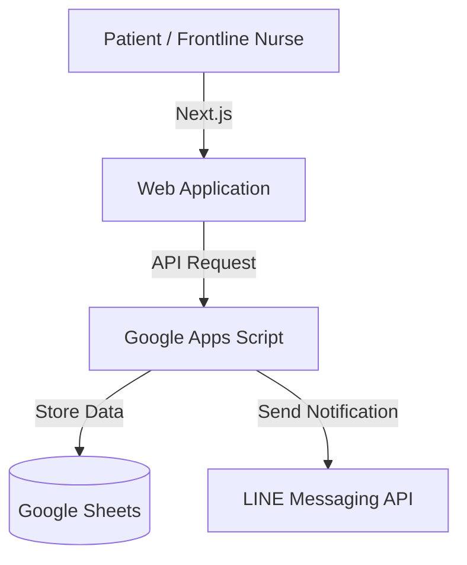

# Telemedicine Registration System

Learned patient registration workflows hands-on at a community hospital and reduced patient registration calls by 80%. Currently in use by [Kamphaeng Phet City Municipality](https://www.google.com/url?q=https%3A%2F%2Fwww.kppmu.go.th%2Fnews-detail%3Fhd%3D1%26id%3D124000&sa=D&sntz=1&usg=AOvVaw0EGdrwtrYvklcSqU5nIwb-).

## Tech Stack
- Frontend: Next.js, Tailwind CSS
- Backend: Google Apps Script
- Data Store: Google Sheets
- Cloud: Vercel
- Communication: LINE Messaging API

## Architecture

