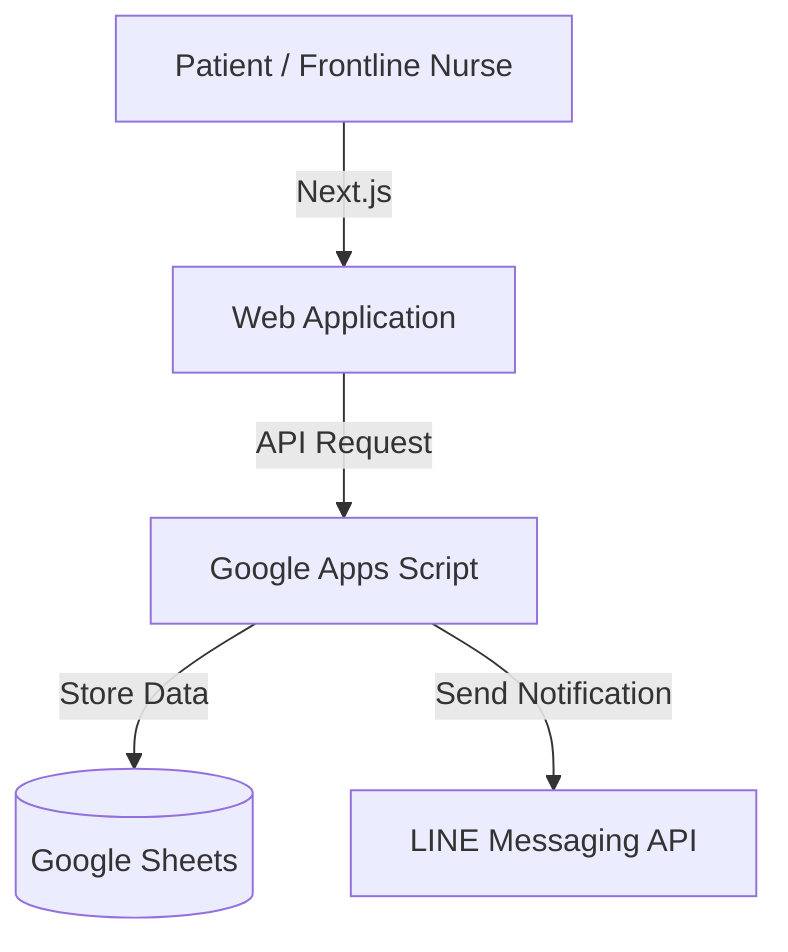

# Telemedicine Registration System

Learned patient registration workflows hands-on at a community hospital, reducing patient registration calls by 80% and currently in use by [Kamphaeng Phet City Municipality](https://www.kppmu.go.th/news-detail?hd=1&id=124000).

## Tech Stack
- Next.js,
- Tailwind CSS
- Google Apps Script
- Google Sheets
- Vercel
- LINE Messaging API

## Architecture

