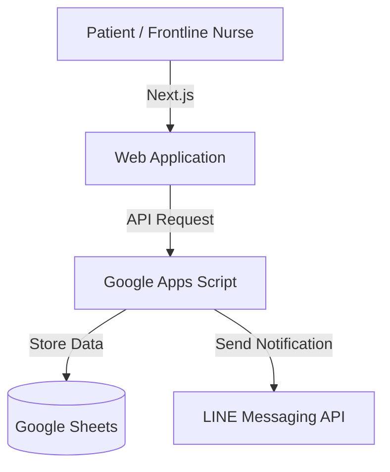

# Patient Registration System

I spent time on-site from 7:00 AM to understand hospital workflows, identified patient registration as a key pain point, and developed a solution that reduced registration calls by approximately 80%.

## Tech Stack
- Frontend: Next.js, Tailwind CSS
- Backend: Google Apps Script
- Data Store: Google Sheets
- Cloud: Vercel
- Communication: LINE Messaging API

## Architecture

