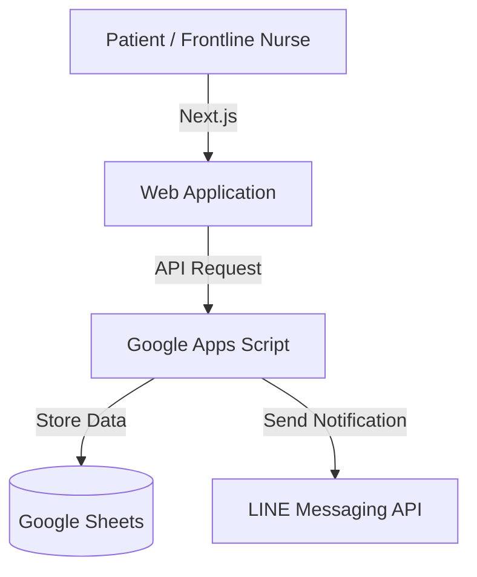

# Telemedicine Registration System

Observed on-site workflows at 7 AM, interpreted nursing terminology, and developed a practical solution using free-tier tools, reducing patient registration calls by 80% and now in active use by [Kamphaeng Phet City Municipality](https://www.kppmu.go.th/news-detail?hd=1&id=124000).

## Tech Stack
- Next.js,
- Tailwind CSS
- Google Apps Script
- Google Sheets
- Vercel
- LINE Messaging API

## Architecture

