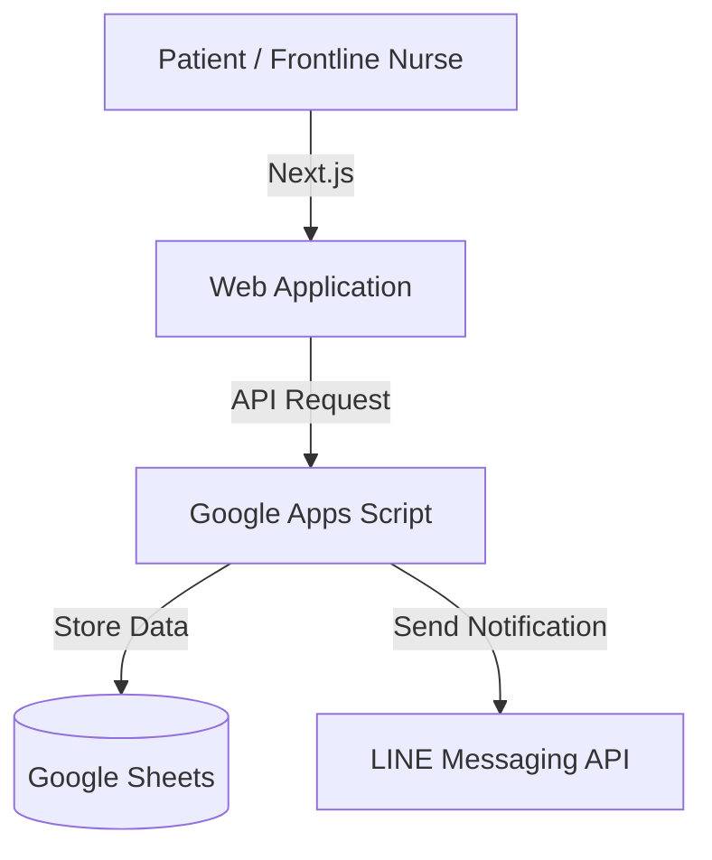

## Tech Stack

- Next.js
- Tailwind CSS
- LINE Messaging API
- Google Apps Script
- Google Sheets
- Vercel

## Architecture

## Real-World Usage

Currently used by [Kamphaeng Phet City Municipality](https://www.kppmu.go.th/news-detail?hd=1&id=124000).
