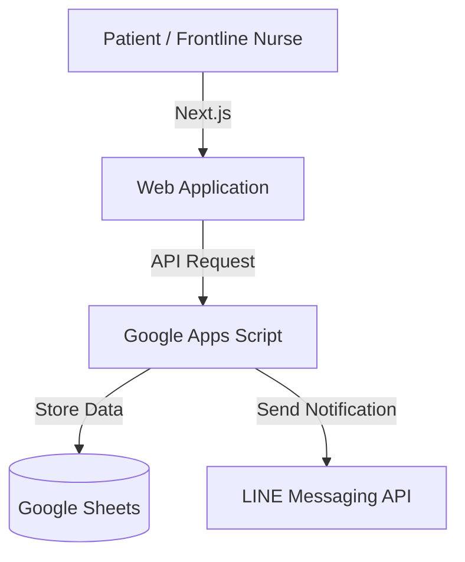

# Patient Registration System

A lightweight patient registration system designed around real-world nurse workflows, reducing patient registration calls by approximately 80% with zero infrastructure cost.

## Features

- Patient registration through a Next.js web application
- Real-time LINE notifications for patients and healthcare staff
- Automatic data synchronization with Google Sheets
- UI designed for accessibility in clinical environments

## Architecture

## Tech Stack
- Frontend: Next.js, Tailwind CSS
- Backend: Google Apps Script
- Data Store: Google Sheets
- Cloud: Vercel
- Communication: LINE Messaging API
